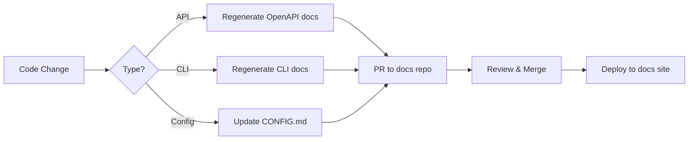

# MADFAM Infrastructure Enhancement Prompt

> **Goal**: Further enhance Foundry + Janua + Enclii setup with zero drift between dev and prod environments.

---

## Current State Summary

### Production (ssh.madfam.io)
- **K3s Cluster**: 3-node cluster (K3s API at 37.27.235.104:6443)
  - `foundry-cp` (EX44, 37.27.235.104, i5-13500 14C/20T, 128GB) -- control plane
  - `foundry-worker-01` (AX41, 95.217.198.239) -- worker node (formerly foundry-core)
  - `foundry-builder-01` -- builder node
- **Namespaces**: enclii, janua, monitoring, data, kube-system
- **Pods**: 16 running (all healthy)
- **Network Policies**: 8 applied (default-deny with specific allows)
- **Observability**: Prometheus + Alertmanager + Grafana
- **Backups**: Daily PostgreSQL at 2 AM, 7-day retention

### Local Development (~/labspace)
- **Repositories**: solarpunk-foundry, janua, enclii
- **Orchestration**: `./madfam` script from solarpunk-foundry
- **Infrastructure**: Docker Compose for shared services

---

## Enhancement Tasks

### Phase 1: Dev/Prod Parity Infrastructure

#### 1.1 Create Unified Kubernetes Manifests
```
Current Problem: Production k8s manifests are applied ad-hoc, not version-controlled
Solution: Create declarative manifests in each repo
```

**Tasks:**
- [ ] Create `k8s/` directory in each repo (janua, enclii)
- [ ] Extract current production manifests: `kubectl get all -n <namespace> -o yaml`
- [ ] Structure manifests by resource type:
  ```
  k8s/
  ├── base/                    # Shared across environments
  │   ├── namespace.yaml
  │   ├── configmaps/
  │   ├── deployments/
  │   ├── services/
  │   └── network-policies/
  ├── overlays/
  │   ├── dev/                 # Local kind/k3d cluster
  │   │   └── kustomization.yaml
  │   └── prod/                # Production overrides
  │       └── kustomization.yaml
  └── kustomization.yaml
  ```
- [ ] Use Kustomize for environment-specific overrides (replicas, resources, secrets)

#### 1.2 Implement Local Kubernetes Environment
```
Current Problem: Local dev uses Docker Compose, prod uses K8s
Solution: Add local k3d/kind cluster option mirroring production
```

**Tasks:**
- [ ] Add k3d cluster creation to `./madfam` script:
  ```bash
  ./madfam k8s-up     # Create local k3d cluster
  ./madfam k8s-down   # Destroy local cluster
  ./madfam k8s-apply  # Apply all manifests
  ```
- [ ] Create shared `ops/k8s/` directory in solarpunk-foundry for:
  - Monitoring stack manifests (prometheus, alertmanager, grafana)
  - Shared infrastructure (postgres, redis)
  - Network policies templates
- [ ] Document when to use Docker Compose vs K8s locally

#### 1.3 Secrets Management Parity
```
Current Problem:
- Prod: Secrets in /opt/solarpunk/secrets/ and k8s secrets
- Dev: .env files scattered across repos
Solution: Unified secrets management
```

**Tasks:**
- [ ] Create `scripts/sync-secrets.sh` that:
  - Generates local `.env` files from template
  - Creates k8s secrets from `.env` for local k8s
  - Documents required secret values per environment
- [ ] Add `.env.template` to each repo with all required vars
- [ ] Create sealed-secrets or SOPS workflow for git-tracked encrypted secrets
- [ ] Document secret rotation procedures

---

### Phase 2: Observability Parity

#### 2.1 Add Prometheus Metrics to Janua
```
Current Problem: Janua API lacks /metrics endpoint
Solution: Add prometheus-fastapi-instrumentator
```

**Tasks:**
- [ ] Add `prometheus-fastapi-instrumentator` to janua requirements.txt
- [ ] Integrate in `apps/api/app/main.py`:
  ```python
  from prometheus_fastapi_instrumentator import Instrumentator
  Instrumentator().instrument(app).expose(app, endpoint="/metrics")
  ```
- [ ] Add custom metrics:
  - `janua_active_sessions` (gauge)
  - `janua_auth_requests_total` (counter by type: login, register, refresh)
  - `janua_oauth_authorizations_total` (counter by provider)
- [ ] Update Prometheus scrape config to include janua-api

#### 2.2 Local Observability Stack
```
Current Problem: No local observability
Solution: Add optional monitoring to docker-compose
```

**Tasks:**
- [ ] Create `ops/local/docker-compose.monitoring.yml`:
  ```yaml
  services:
    prometheus:
      image: prom/prometheus:latest
      ports: ["9090:9090"]
      volumes:
        - ./prometheus:/etc/prometheus
    grafana:
      image: grafana/grafana:latest
      ports: ["3000:3000"]
  ```
- [ ] Add `./madfam monitoring` command to start/stop
- [ ] Share Grafana dashboards between dev/prod via ConfigMaps

#### 2.3 Unified Alert Rules
```
Current Problem: Alert rules only in production
Solution: Version-controlled alert rules
```

**Tasks:**
- [ ] Create `ops/monitoring/prometheus-rules/` in solarpunk-foundry:
  ```
  prometheus-rules/
  ├── infrastructure.yml
  ├── services.yml
  ├── pods.yml
  └── latency.yml
  ```
- [ ] Apply same rules to both local and prod Prometheus
- [ ] Add Alertmanager webhook for Slack/Discord notifications (prod only)

---

### Phase 3: CI/CD and Deployment Parity

#### 3.1 Automated Image Building
```
Current Problem: Manual docker build and push to localhost:5000
Solution: CI/CD pipeline with registry
```

**Tasks:**
- [ ] Set up GitHub Actions for janua and enclii:
  ```yaml
  on:
    push:
      branches: [main]
  jobs:
    build:
      - Build Docker image
      - Push to registry (ghcr.io or private)
      - Update k8s manifest with new image tag
  ```
- [ ] Configure local registry for dev (already have localhost:5000)
- [ ] Create `scripts/deploy.sh` that:
  - Builds image locally
  - Pushes to appropriate registry
  - Applies k8s manifests
  - Waits for rollout

#### 3.2 GitOps Workflow
```
Current Problem: Manual kubectl apply
Solution: ArgoCD or Flux for automated deployments
```

**Tasks (Optional - Advanced):**
- [ ] Install ArgoCD in production cluster
- [ ] Configure repo sync for janua and enclii k8s/ directories
- [ ] Set up automatic sync for staging, manual approval for prod

#### 3.3 Database Migration Parity
```
Current Problem: Alembic migrations run manually
Solution: Automated migration on deployment
```

**Tasks:**
- [ ] Add init container to janua-api deployment:
  ```yaml
  initContainers:
    - name: migrate
      image: janua-api:latest
      command: ["alembic", "upgrade", "head"]
  ```
- [ ] Same for enclii if using migrations
- [ ] Add migration dry-run to CI pipeline

---

### Phase 4: Configuration Parity

#### 4.1 Environment Configuration Standards
```
Current Problem: Different env var names and values between dev/prod
Solution: Standardized configuration
```

**Tasks:**
- [ ] Create `CONFIG.md` in each repo documenting all env vars:
  ```markdown
  | Variable | Required | Default | Description |
  |----------|----------|---------|-------------|
  | DATABASE_URL | Yes | - | PostgreSQL connection string |
  ```
- [ ] Use same env var names in all environments
- [ ] Add config validation on startup (fail fast if missing required vars)

#### 4.2 Port Allocation Enforcement
```
Current Problem: Legacy ports (8000) still in use alongside standard (4100)
Solution: Full migration to standard ports
```

**Tasks:**
- [ ] Update Janua docker-compose to use 4100 instead of 8000
- [ ] Update all Cloudflare tunnel routes to use standard ports
- [ ] Update all service references to use standard ports
- [ ] Remove legacy port forwards after validation
- [ ] Add port validation script: `./madfam verify-ports`

#### 4.3 Network Policy Templates
```
Current Problem: Network policies created ad-hoc
Solution: Templated network policies per service type
```

**Tasks:**
- [ ] Create network policy templates in solarpunk-foundry:
  ```yaml
  # ops/k8s/templates/network-policy-api.yaml
  apiVersion: networking.k8s.io/v1
  kind: NetworkPolicy
  metadata:
    name: allow-${SERVICE_NAME}-api
  spec:
    podSelector:
      matchLabels:
        app: ${SERVICE_NAME}-api
    ingress:
      - from:
          - namespaceSelector: {}
        ports:
          - port: ${API_PORT}
  ```
- [ ] Generate per-service policies from templates
- [ ] Apply same policies in dev k8s cluster

---

### Phase 5: Testing Parity

#### 5.1 Integration Test Environment
```
Current Problem: No integration tests against real infrastructure
Solution: E2E tests that run against both dev and prod-like environment
```

**Tasks:**
- [ ] Create `tests/e2e/` directory in each repo
- [ ] Write tests for critical flows:
  - Janua: Login, Register, OAuth flow, Token refresh
  - Enclii: Project creation, Service deployment, Health checks
- [ ] Add `./madfam test-e2e` command that:
  - Spins up local k8s if not running
  - Applies manifests
  - Runs e2e tests
  - Reports results

#### 5.2 Smoke Tests for Production
```
Current Problem: Manual health check verification
Solution: Automated production smoke tests
```

**Tasks:**
- [ ] Create `scripts/smoke-test.sh`:
  ```bash
  #!/bin/bash
  ENDPOINTS=(
    "https://api.janua.dev/health"
    "https://api.enclii.dev/health"
    "https://api.enclii.dev/metrics"
    "https://app.janua.dev"
    "https://app.enclii.dev"
  )
  for url in "${ENDPOINTS[@]}"; do
    status=$(curl -s -o /dev/null -w '%{http_code}' "$url")
    echo "$url: $status"
  done
  ```
- [ ] Run smoke tests after every deployment
- [ ] Add to monitoring/alerting

---

### Phase 6: Documentation and Runbooks

#### 6.1 Operational Runbooks
```
Current Problem: Tribal knowledge for common operations
Solution: Documented runbooks
```

**Tasks:**
- [ ] Create `docs/runbooks/` in solarpunk-foundry:
  ```
  runbooks/
  ├── deployment.md           # How to deploy changes
  ├── rollback.md             # How to rollback a bad deploy
  ├── database-restore.md     # How to restore from backup
  ├── secrets-rotation.md     # How to rotate secrets
  ├── scaling.md              # How to scale services
  ├── debugging.md            # Common debugging steps
  └── incident-response.md    # What to do when things break
  ```

#### 6.2 Architecture Diagrams
```
Current Problem: No visual documentation of infrastructure
Solution: Diagrams as code
```

**Tasks:**
- [ ] Create Mermaid diagrams in `docs/architecture/`:
  - Network topology (namespaces, pods, services)
  - Data flow (requests, auth, database)
  - Deployment pipeline
- [ ] Keep diagrams updated with infrastructure changes

---

## Implementation Priority

### Immediate (This Week)
1. **Phase 1.1**: Create k8s/ directories with extracted manifests
2. **Phase 2.1**: Add /metrics to Janua API
3. **Phase 4.2**: Migrate to standard ports
4. **Phase 7.2**: Audit current docs for accuracy

### Short-term (Next 2 Weeks)
5. **Phase 1.3**: Secrets management unification
6. **Phase 3.1**: Basic CI/CD for image building
7. **Phase 5.2**: Production smoke tests
8. **Phase 7.3**: Set up OpenAPI doc generation

### Medium-term (Next Month)
9. **Phase 1.2**: Local k8s environment
10. **Phase 2.2**: Local observability stack
11. **Phase 6.1**: Operational runbooks
12. **Phase 7.5**: Implement docs sync workflow

### Long-term (Ongoing)
13. **Phase 3.2**: GitOps with ArgoCD
14. **Phase 5.1**: Full E2E test suite
15. **Phase 6.2**: Architecture diagrams
16. **Phase 7.8**: Track documentation quality metrics

---

## Drift Detection

### Automated Checks
Add to `./madfam` script:

```bash
./madfam drift-check    # Compare local manifests to production
./madfam sync-prod      # Pull current prod state to local manifests
./madfam diff           # Show differences between dev and prod configs
```

### Manual Verification Checklist
Run weekly:

- [ ] Compare k8s manifests: `kubectl diff -f k8s/overlays/prod/`
- [ ] Verify secret values match (keys, not values)
- [ ] Check port allocations: `./madfam verify-ports`
- [ ] Review Prometheus targets: `curl localhost:9090/api/v1/targets`
- [ ] Validate network policies: `kubectl get networkpolicies -A`
- [ ] Test backup restoration: Monthly dry-run

---

## Success Criteria

### Dev/Prod Parity Achieved When:
- [ ] Same k8s manifests deploy to both environments (with overlays)
- [ ] Same Docker images run in dev and prod
- [ ] Same environment variable names used everywhere
- [ ] Same port allocations in all environments
- [ ] Same observability stack available locally
- [ ] Same network policies applied
- [ ] Deployment process identical (just different targets)

### Measurable Metrics:
- Zero manual `kubectl` commands for normal operations
- Deployment time < 5 minutes from commit to running
- < 24 hours to detect drift between environments
- 100% of services have health and metrics endpoints
- All runbooks tested quarterly

---

## Quick Reference Commands

```bash
# Local Development
./madfam start              # Start core services (docker-compose)
./madfam full               # Start all services
./madfam k8s-up             # Create local k8s cluster
./madfam k8s-apply          # Apply all manifests

# Production
ssh ssh.madfam.io           # Access production server
sudo kubectl get pods -A    # View all pods
sudo kubectl logs -f <pod>  # View logs

# Deployment
./scripts/deploy.sh janua   # Deploy janua to prod
./scripts/deploy.sh enclii  # Deploy enclii to prod

# Verification
./madfam verify-ports       # Check port allocations
./madfam drift-check        # Check for configuration drift
./scripts/smoke-test.sh     # Run production health checks

# Debugging
./madfam logs janua         # View janua logs
./madfam shell janua-api    # Shell into janua-api container
```

---

## Phase 7: Evidence-Based Documentation Strategy

> **Goal**: Ensure all documentation across codebases and public developer docs (docs.janua.dev, docs.enclii.dev) is accurate, up-to-date, and evidence-based.

### 7.1 Documentation Architecture

```
Documentation Hierarchy:
├── Source of Truth (Code)
│   ├── CLAUDE.md          # AI assistant context per repo
│   ├── README.md          # Getting started
│   ├── CONFIG.md          # Environment variables
│   └── CHANGELOG.md       # Version history
│
├── Developer Docs (Public Sites)
│   ├── docs.janua.dev     # Janua developer documentation
│   │   ├── Getting Started
│   │   ├── API Reference (OpenAPI-generated)
│   │   ├── SDK Guides
│   │   ├── Authentication Flows
│   │   └── Self-Hosting Guide
│   │
│   └── docs.enclii.dev    # Enclii developer documentation
│       ├── Getting Started
│       ├── CLI Reference
│       ├── Service Configuration
│       ├── Deployment Strategies
│       └── API Reference
│
├── Operational Docs (Internal)
│   ├── solarpunk-foundry/docs/runbooks/
│   └── solarpunk-foundry/docs/architecture/
│
└── API Specs (Auto-Generated)
    ├── janua: /docs (FastAPI Swagger)
    └── enclii: /docs (Go Swagger)
```

### 7.2 Evidence-Based Documentation Principles

#### Principle 1: Code is Truth
```
Every documentation claim MUST be verifiable against running code.

Verification Methods:
- API endpoints → Test against live API or OpenAPI spec
- CLI commands → Execute and capture output
- Configuration → Validate against .env.template
- Code examples → Include in test suite
```

#### Principle 2: Automated Documentation Generation
```yaml
Auto-Generated Sources:
  api_reference:
    source: OpenAPI schema from running API
    tool: Redoc or Swagger UI
    trigger: On every API change

  cli_reference:
    source: --help output from CLI
    tool: Custom markdown generator
    trigger: On CLI update

  config_reference:
    source: .env.template + validation schema
    tool: envdoc or custom script
    trigger: On config change

  changelog:
    source: Conventional commits
    tool: standard-version or semantic-release
    trigger: On release
```

#### Principle 3: Documentation Testing
```bash
# Add to CI pipeline
./scripts/test-docs.sh

# Contents:
# 1. Validate all code examples compile/run
# 2. Check all internal links resolve
# 3. Verify API examples against OpenAPI spec
# 4. Ensure screenshots match current UI
```

### 7.3 Documentation Drift Detection

#### Automated Checks
```yaml
# .github/workflows/docs-validation.yml
name: Documentation Validation
on:
  push:
    paths:
      - 'docs/**'
      - 'apps/api/**'
      - 'apps/cli/**'
jobs:
  validate:
    steps:
      - name: Generate API docs from OpenAPI
        run: |
          curl -s http://localhost:4100/openapi.json > api-spec.json
          npx @redocly/cli build-docs api-spec.json

      - name: Compare with committed docs
        run: |
          diff -r docs/api generated-docs/

      - name: Test code examples
        run: |
          ./scripts/test-code-examples.sh

      - name: Check for stale content
        run: |
          # Flag docs not updated in 90 days
          find docs -name "*.md" -mtime +90 -exec echo "STALE: {}" \;
```

#### Manual Review Triggers
```markdown
Review documentation when:
- [ ] API endpoint added/removed/modified
- [ ] CLI command added/removed/modified
- [ ] Environment variable added/removed
- [ ] Authentication flow changed
- [ ] Error codes changed
- [ ] SDK major version released
- [ ] Breaking change introduced
```

### 7.4 Public Documentation Sites

#### docs.janua.dev Structure
```
apps/docs/
├── content/
│   ├── 01-getting-started/
│   │   ├── introduction.mdx
│   │   ├── quickstart.mdx
│   │   ├── installation.mdx
│   │   └── first-login.mdx
│   ├── 02-authentication/
│   │   ├── email-password.mdx
│   │   ├── oauth-providers.mdx
│   │   ├── saml-sso.mdx
│   │   ├── mfa.mdx
│   │   └── passkeys.mdx
│   ├── 03-api-reference/
│   │   ├── overview.mdx
│   │   └── [auto-generated from OpenAPI]
│   ├── 04-sdks/
│   │   ├── react.mdx
│   │   ├── nextjs.mdx
│   │   ├── vue.mdx
│   │   ├── python.mdx
│   │   └── go.mdx
│   ├── 05-self-hosting/
│   │   ├── docker.mdx
│   │   ├── kubernetes.mdx
│   │   └── configuration.mdx
│   └── 06-migration/
│       ├── from-auth0.mdx
│       └── from-firebase.mdx
├── components/
│   ├── CodeExample.tsx      # Live-tested code snippets
│   ├── ApiEndpoint.tsx      # OpenAPI-driven endpoint docs
│   └── VersionBadge.tsx     # Version compatibility indicators
└── scripts/
    ├── generate-api-docs.ts  # OpenAPI → MDX
    ├── test-examples.ts      # Run all code examples
    └── check-links.ts        # Validate internal links
```

#### docs.enclii.dev Structure
```
apps/docs/
├── content/
│   ├── 01-getting-started/
│   │   ├── introduction.mdx
│   │   ├── quickstart.mdx
│   │   └── first-deployment.mdx
│   ├── 02-cli-reference/
│   │   ├── overview.mdx
│   │   ├── init.mdx
│   │   ├── deploy.mdx
│   │   ├── logs.mdx
│   │   └── rollback.mdx
│   ├── 03-configuration/
│   │   ├── service-spec.mdx
│   │   ├── environment-variables.mdx
│   │   ├── secrets.mdx
│   │   └── networking.mdx
│   ├── 04-deployment/
│   │   ├── strategies.mdx
│   │   ├── rollbacks.mdx
│   │   └── scaling.mdx
│   └── 05-api-reference/
│       └── [auto-generated]
└── scripts/
    ├── generate-cli-docs.ts  # CLI --help → MDX
    └── generate-api-docs.ts  # OpenAPI → MDX
```

### 7.5 Documentation Sync Workflow

#### On Code Change


#### Weekly Sync Tasks
```bash
# scripts/weekly-docs-sync.sh

echo "=== Documentation Sync Report ==="

# 1. Check API documentation freshness
echo "Checking API docs..."
LAST_API_CHANGE=$(git log -1 --format="%ci" -- apps/api/)
LAST_DOC_CHANGE=$(git log -1 --format="%ci" -- apps/docs/content/03-api-reference/)
echo "API changed: $LAST_API_CHANGE"
echo "Docs changed: $LAST_DOC_CHANGE"

# 2. Validate OpenAPI spec matches docs
echo "Validating OpenAPI spec..."
curl -s http://localhost:4100/openapi.json | \
  jq '.paths | keys[]' | \
  sort > /tmp/api-endpoints.txt
grep -h "endpoint:" apps/docs/content/03-api-reference/*.mdx | \
  sort > /tmp/doc-endpoints.txt
diff /tmp/api-endpoints.txt /tmp/doc-endpoints.txt

# 3. Check for undocumented env vars
echo "Checking environment variables..."
grep -rh "os.getenv\|process.env" apps/ | \
  grep -oE '[A-Z_]+' | sort -u > /tmp/code-envs.txt
grep -h "^|" CONFIG.md | \
  grep -oE '[A-Z_]+' | sort -u > /tmp/doc-envs.txt
diff /tmp/code-envs.txt /tmp/doc-envs.txt

# 4. Generate report
echo "=== Action Items ==="
# ... generate actionable items
```

### 7.6 Version-Aware Documentation

#### Version Badges
```jsx
// components/VersionBadge.tsx
<VersionBadge
  feature="OAuth Provider Registration"
  addedIn="0.5.0"
  deprecated={null}
/>

// Renders: "Added in v0.5.0"
```

#### Breaking Change Callouts
```jsx
// components/BreakingChange.tsx
<BreakingChange version="1.0.0">
  The `client_secret` field is now required for confidential clients.
  See [migration guide](/docs/migration/v1) for details.
</BreakingChange>
```

#### SDK Compatibility Matrix
```markdown
| Feature | React SDK | Vue SDK | Python SDK | Go SDK |
|---------|-----------|---------|------------|--------|
| Email/Password | ✅ 0.1+ | ✅ 0.1+ | ✅ 0.1+ | ✅ 0.1+ |
| OAuth | ✅ 0.2+ | ✅ 0.2+ | ✅ 0.2+ | ✅ 0.2+ |
| Passkeys | ✅ 0.5+ | ⏳ 0.6 | ❌ | ❌ |
| MFA | ✅ 0.3+ | ✅ 0.3+ | ✅ 0.3+ | ⏳ 0.4 |
```

### 7.7 CLAUDE.md Maintenance

Each repository's `CLAUDE.md` should be the authoritative source for AI assistants:

```markdown
# Required CLAUDE.md Sections

## Project Overview
- Current status (alpha/beta/stable)
- Primary purpose
- Key features

## Quick Start
- Setup commands
- Required environment variables
- First run instructions

## Architecture
- Key directories and their purpose
- Important files
- Data flow

## Development Commands
- Build commands
- Test commands
- Lint commands

## Port Allocation
- Standard ports per PORT_ALLOCATION.md
- Development overrides

## API Reference
- Key endpoints
- Authentication requirements

## Common Tasks
- How to add a new endpoint
- How to add a new migration
- How to run specific tests

## Troubleshooting
- Common errors and solutions
- Debug commands
```

### 7.8 Documentation Quality Metrics

```yaml
Metrics to Track:
  freshness:
    - Last updated date per page
    - Pages not updated in 90 days flagged

  accuracy:
    - Code examples passing tests
    - API examples matching OpenAPI spec
    - Links resolving correctly

  completeness:
    - All public endpoints documented
    - All CLI commands documented
    - All env vars documented
    - All error codes documented

  engagement:
    - Page views (via analytics)
    - Search queries (what are people looking for?)
    - 404 errors (what's missing?)
    - Feedback submissions
```

### 7.9 Documentation Tasks Checklist

#### Immediate
- [ ] Audit current docs for accuracy against running code
- [ ] Set up OpenAPI doc generation for Janua API
- [ ] Create CLAUDE.md template for all repos
- [ ] Add documentation validation to CI

#### Short-term
- [ ] Implement weekly docs sync script
- [ ] Add version badges to docs
- [ ] Create SDK compatibility matrix
- [ ] Set up docs analytics

#### Medium-term
- [ ] Build live code example testing
- [ ] Implement docs search
- [ ] Add interactive API explorer
- [ ] Create video tutorials for key flows

---

*Document Version: 1.1.0 | Created: 2025-12-08 | Last Updated: 2025-12-08*
